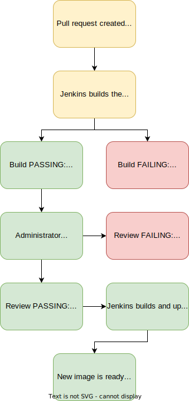

# Portfolio (reboot version)

This project is my portfolio created with React and Tailwind V3.

You can check out the live page at [dchew.kitsuiro.com](https://dchew.kitsuiro.com)!

## Concepts

It's meant to be a static page, fully responsive, with elegant transitions. Pulled out all the stops when it comes to
design, pretty much. It is my portfolio after all.

### Frontend/UI

Self-explanatory, I just tried to make it look more interesting.

- Tons of animations and transitions
- Light, elegant color scheme that's good on the eyes
- Possibility of adding dark mode in the future

I had some issues with animation jank at the start, but I managed to reduce it. I actually thought (mistakenly) that the
React Transition Group library was kind of annoying to set up but in the end, it's the one I settled on.

### Workflow, CI/CD Pipeline

Similar to my previous [landing page project](https://github.com/chew01/landing-page), I'm hosting my own instance of
Jenkins inside a Docker container on my server, so I decided, might as well try it out on this project and practise my
workflow skills!

The diagram below is exactly the same, and should be self-explanatory.

